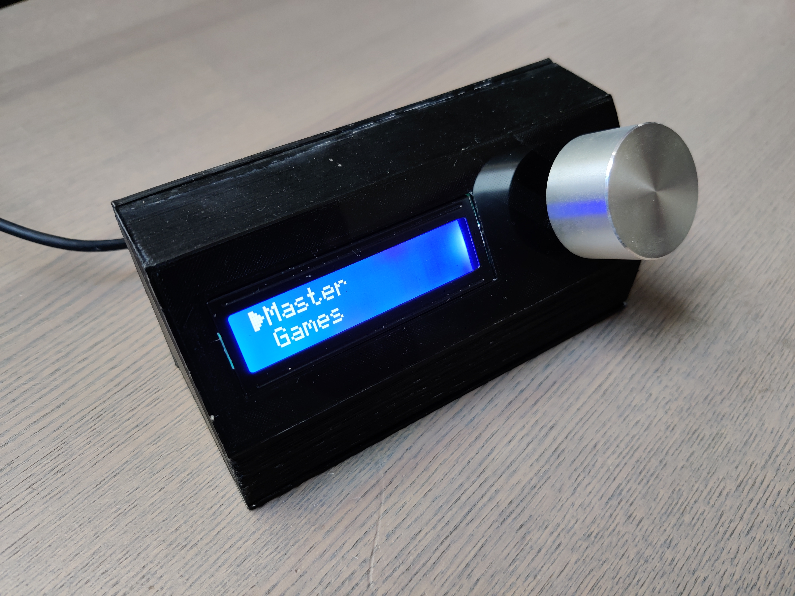

# deej volume controller

This is a modified version of [YaMoef´s](https://github.com/YaMoef/deej) deej version ([Original deej](https://github.com/omriharel/deej)). I wanted to control the volume of different programs instead of using the mixer of Windows and was quiet happy I discovered deej. I also wanted to have "virtual" sliders, instead of sliders that have a physical start and endpoint. So I used YaMoef´s version, who did a great job optimising deej for rotary encoders. 
My version enables communication between the arduino and windows in both directions. This means that the arduino can get the correct soundmixer levels from the computer, when they are changed there. 
Another feature I implemented is the autoconnect function. When the Arduino gets disconnected from the compute, deej tries to reconnect until the com port is available again. This way you don't have to restart deej every time you reconnect the controller.

# Main changes

Here is what I added to deej to fit my needs:

- Deej now sends slider values to the arduino
  - when the volume of a programm was changed directly on windows
  - once when the connection to the arduino is established. Because of that no eeprom is required anymore (unlike YaMoef´s approach)
- deej automatically reconnects to the arduino if the connection got lost

I also redid the arduino sketch:
- You can mute an unmute each knob by pressing the rotary encoder
- The arduino automatically reaches out for deej to get the newest slider values on startup

# Build process

I took the idea from ([Optagon](https://www.thingiverse.com/optagon)) and ([ocyrus99](https://www.thingiverse.com/ocyrus99)) who used 5 potentiometers with leds to indicate the current levels. Another cool thing is the interchangeable logos for each controller. I replaced the potentiometers with rotary encoders, which have the advantage that you can rotate them continuously in either direction. I also wanted to synchronize the slider values between the computer an the arduino. Therefore I had to edit some lines in serial.go, session_map.go and slider_map.go in order to send values to the arduino. The leds are just from a simple WS2812B strip I already had at home, but I had to fold it a bit because the leds were too far apart. 

# Parts needed

- 4 rotary encoder with pushbutton
- 1 Arduino pro micro
- 5 addressable leds (I used WS2812B)
- if needed filter circuit for rotary encoders:
  - 4 10kohm resistors
  - 2 10nF (=0.01µF) ceramic capacitors)

# Arduino code

The arduino code is based on the one of YaMoef and ocyrus99. This combines the support for rotary encoders and the led controls into one sketch. I also modified both versions and implemented my new features. As my rotary encoders were inverted, I had to change some values.

The libraries used are libraries either stock in arduino, or can be installed through the build-in library manager of arduino (Sketch > Include Library > Manage Libraries).

# Rotary encoder

If you have a rotary encoder with a filter or you want to build your own filterboard head over to [YaMoef](https://github.com/YaMoef/deej#rotary-encoder). He explained everything you need an how to build one. 

# 3D printing

The case is a remixed version of Optagon's design by ocyrus99. It can be found on [Thingiverse](https://www.thingiverse.com/thing:4599505). The version by ocyrus99 is a bit thinner, which I preferred in my build.
The knobs are some aluminium ones I found at home, but you can use any other or just 3d print one.

# Building deej

This is a custom version of the deej and needs to be builded, this can be done in the scripts folder.

# Contact

If you got any questions you can start a pull request or an issue.
